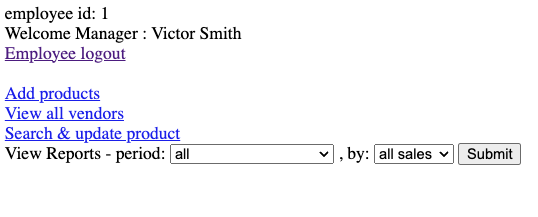
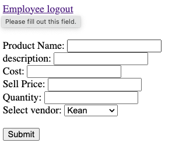
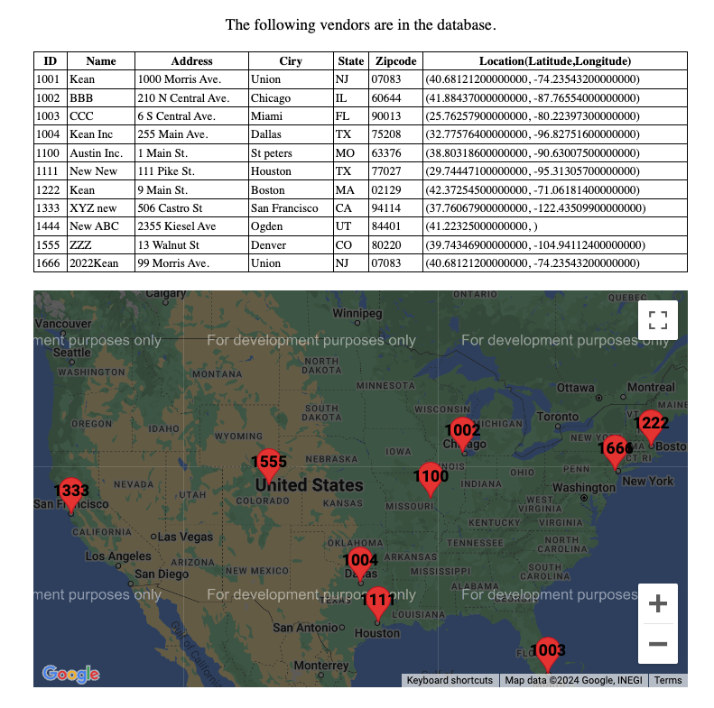
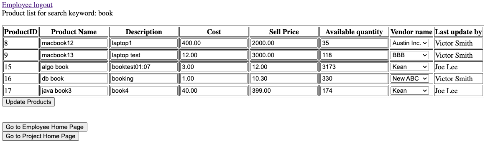
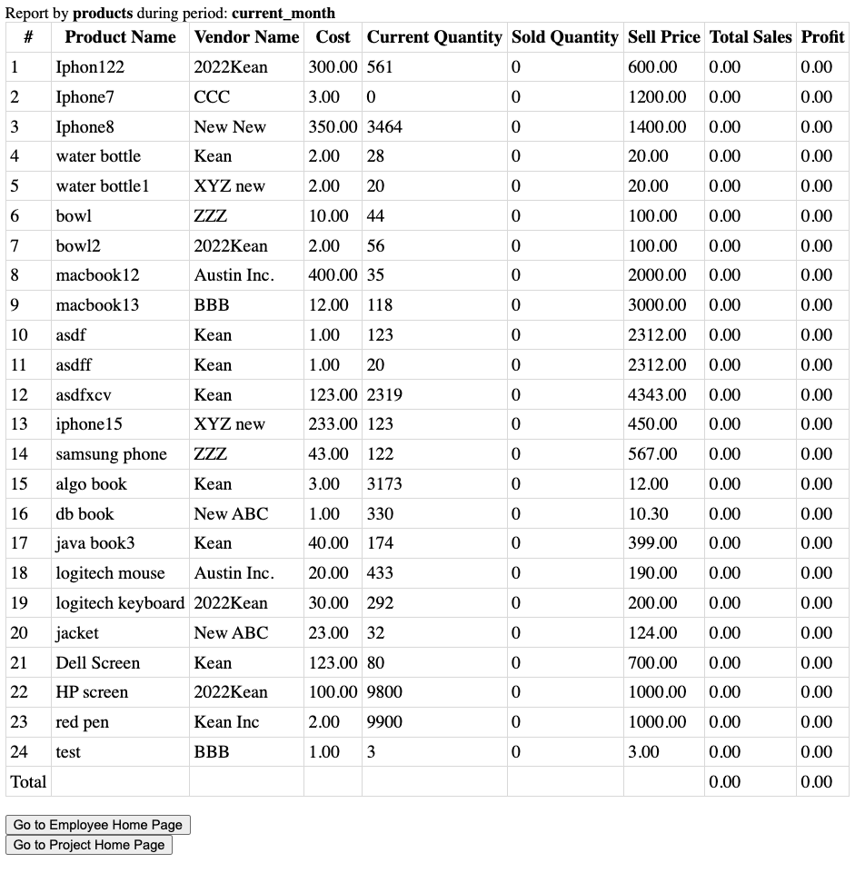
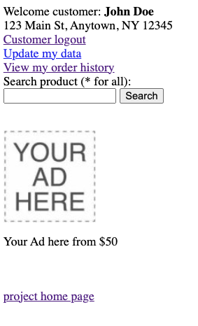
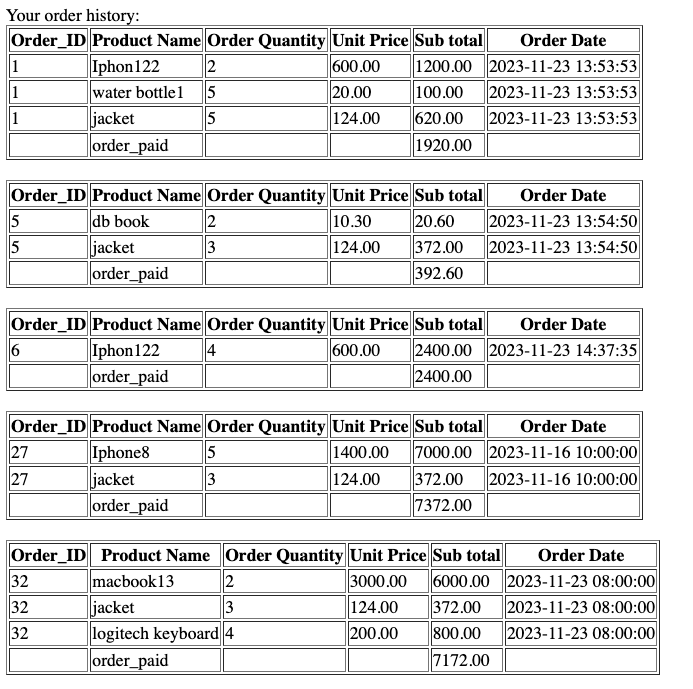
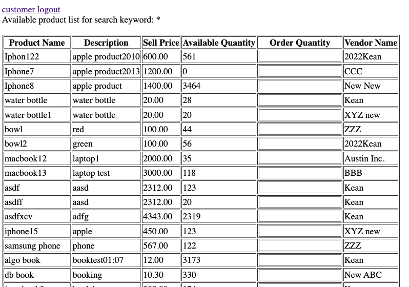

# Inventory Management and Order Processing System

demo: https://obi.kean.edu/~lintzuh@kean.edu/CPS5740/index.html  
github: https://github.com/tzuhan2424/CPS5740
# Introduction
This system enables vendors to add products, search for products, and view sales reports through a web application. Conversely, it allows customers to view orders and search for the products they want.

# What I learned from this project
This project shifts much of the operational logic to the database level, with numerous aggregations and calculations handled by stored procedures stored in the database. This design reduces the load on the application server, particularly beneficial for managing extensive data operations such as online transactions or large-scale inventory management.

Additionally, the system supports concurrent operations for multiple customers, enhancing the user experience by allowing simultaneous access and interactions.### Benefits of Database-Level Operations

#### Some benefits of transfer to database level: 
- **Efficient Data Handling:** Database systems are optimized for performing data-related operations like sorting, filtering, joining, and aggregation. Offloading these operations to the database can yield better performance than handling them in the application layer.
- **Reduced Data Transfer:** By performing operations on the database server, only the necessary results are sent to the application, reducing the amount of data transferred over the network. This is particularly beneficial when dealing with large datasets.
- **Concurrent Data Processing:** Databases are designed to handle multiple operations simultaneously, efficiently managing concurrent data access and updates, which is crucial for high-traffic applications.
- **Consistency:** Stored procedures ensure that the same logic is applied consistently across different parts of an application and even across multiple applications that access the database.
- **Reduced Application Complexity:** By shifting complex operations to the database, the application code becomes simpler and often more robust, focusing primarily on presentation and user interactions.

# System View
## Employee

    1. Main Employee function

    2. Employees can enter product information into the inventory system, which includes basic input validation such as ensuring the quantity is a numeric value.

    3. Employee could view vendor on table and also map.

    4. Employees can search for products using pattern matching and, within the same interface, update product information such as name, price, and quantity.

    5. Employees can select time periods such as "past month" or "past week," and filter reports by vendors or products for various reporting purposes. These reports are generated using stored procedures and sent to the application level.

## Customer

   1. Customer could view order history and search available product

   2. Customer could view order history by order ID.

   3. Customer could search by keyword, and could order the item on this page

# Technology and Tools
html, php, mysql, linux

